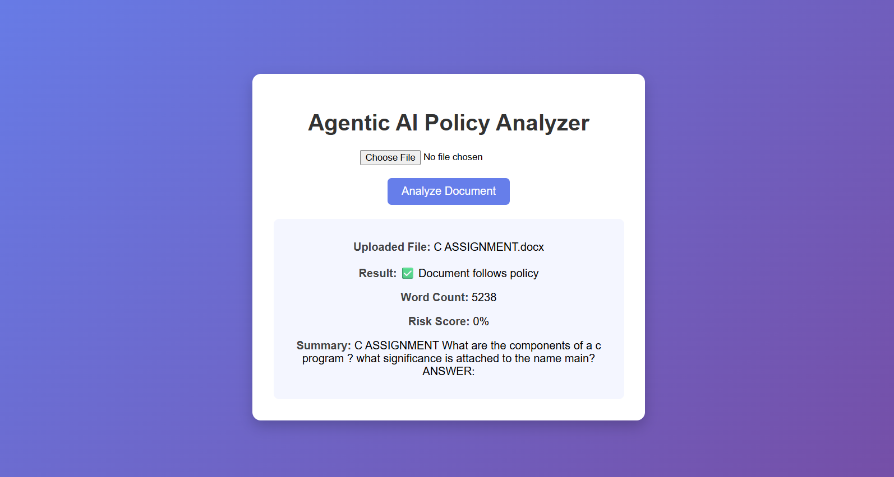

Agentic AI Policy Compliance Analyzer

Project Overview

The Agentic AI Policy Compliance Analyzer is a web-based application that analyzes uploaded documents and checks whether they follow predefined policy rules. The system identifies restricted words, calculates a risk score, and provides a preview of the document.

Features

- Upload and analyze documents
- Detect policy violations using rule-based logic
- Calculate risk score based on detected issues
- Display document word count
- Generate document preview
- Support for TXT and DOCX files

Technologies Used

- Python
- Flask
- HTML
- CSS
- JSON

Project Structure

agentic_ai_project
│
├── app.py
├── agent.py
├── utils.py
├── rules.json
├── templates/
│   └── index.html
└── uploads/

How to Run the Project

1. Clone the repository
2. Install required libraries
3. Run the application

Install dependencies:

pip install flask python-docx

Run the application:

python app.py

Open the browser and go to:

http://127.0.0.1:5000

Future Improvements

- Add PDF document support
- Integrate AI-based summarization
- Improve UI dashboard
- Add multiple AI agents for advanced policy analysis

Author

Developed as a beginner AI + Web Development project for learning document analysis and agent-based systems.
## Project Screenshot

